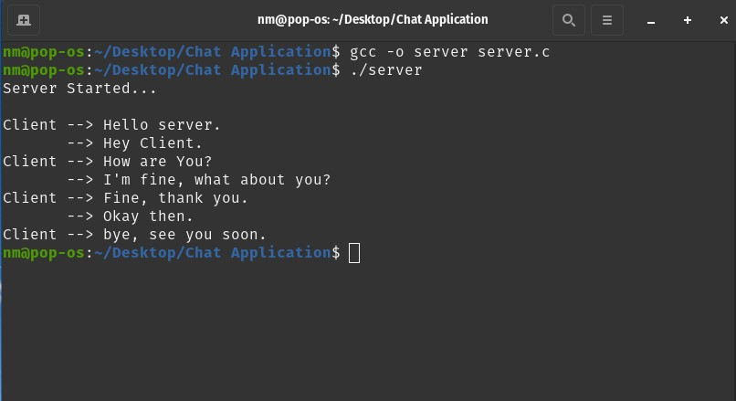
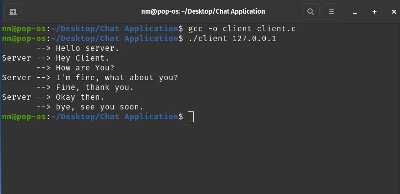

# Server Chat Application

A chat application using socket programming in C.
<br>
To more about Sockets and functions used in the files, do check out this link : [Beej Guide to Network Programming](https://beej.us/guide/bgnet/html/)

## Usage

1. Open a terminal and create an executable for **server** by running
    ```
    gcc -o server server.c
    ```
2. Run the server using
    ```
    ./server
    ```
3. Open another terminal and create an executable for **client** by running
    ```
    gcc -o client client.c
    ```
4. Run the **client** using
    ```
    ./client 127.0.0.1
    ```
5. The connection will now be established and both can start chat (_initiated by client first_)
6. The connection can be terminated whenever any (client/server) sends message starting with `bye`.

---

## Screenshots


**<center>Server Terminal</center>**
<br>
<br>


**<center>Client Terminal</center>**
<br>
<br>
